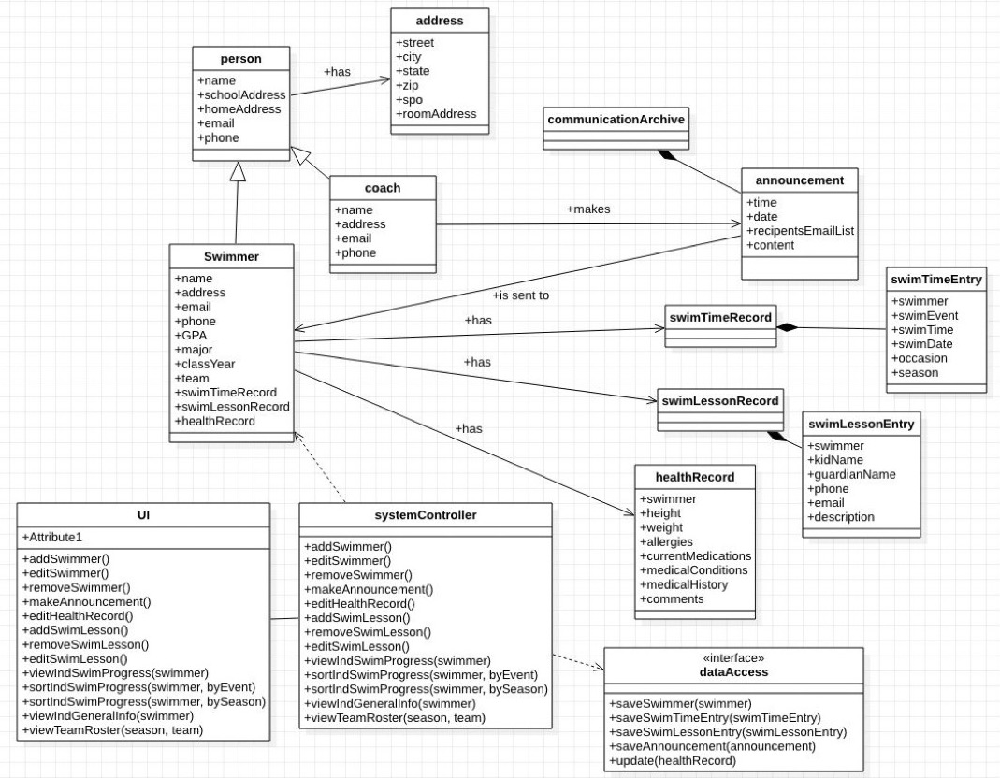
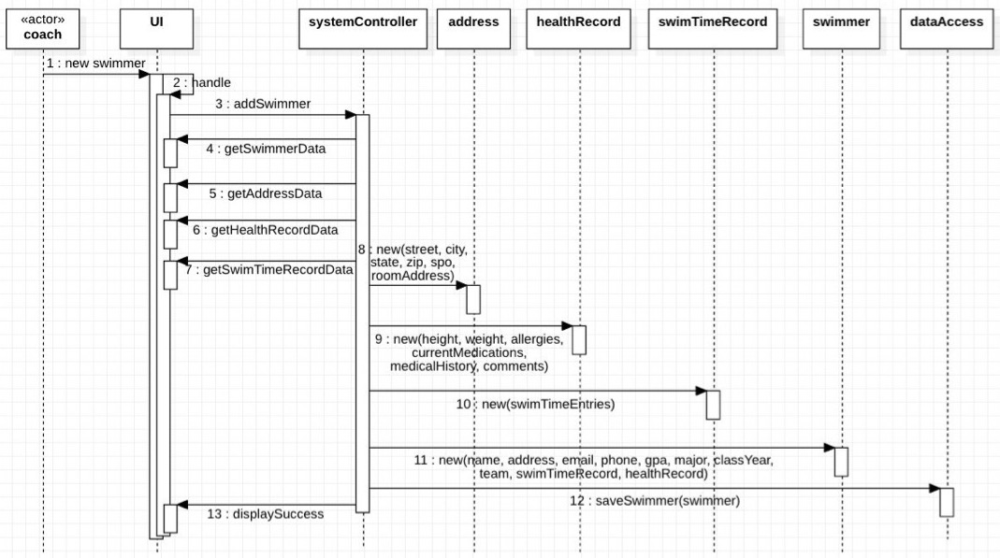
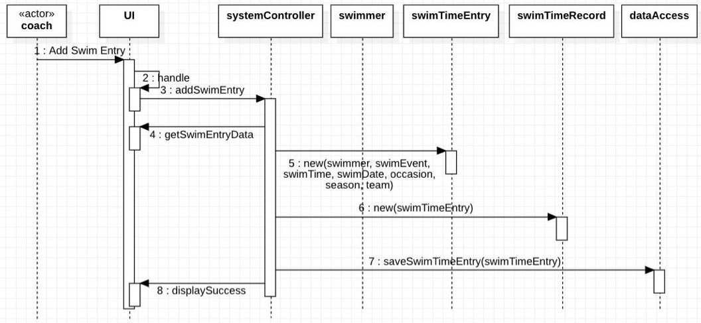
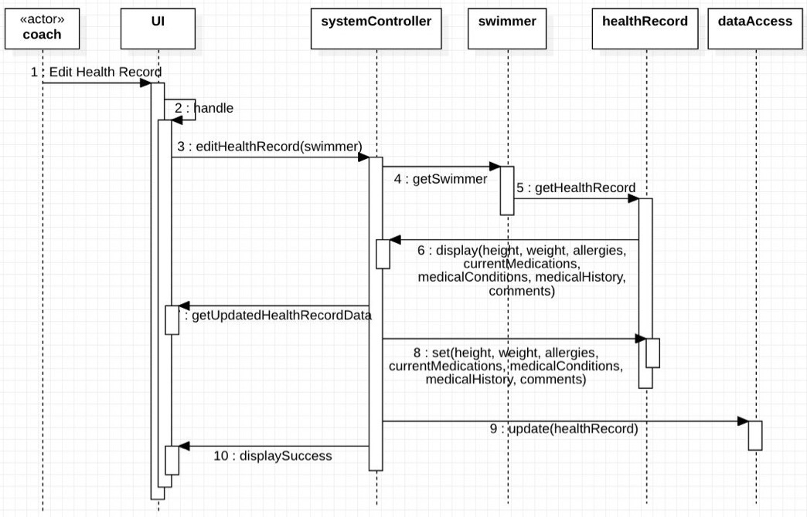
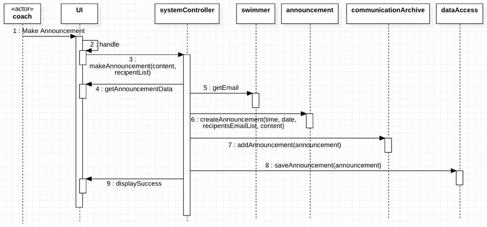
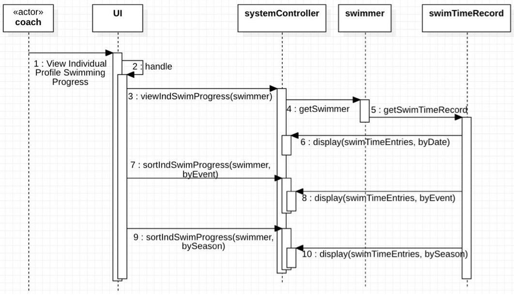
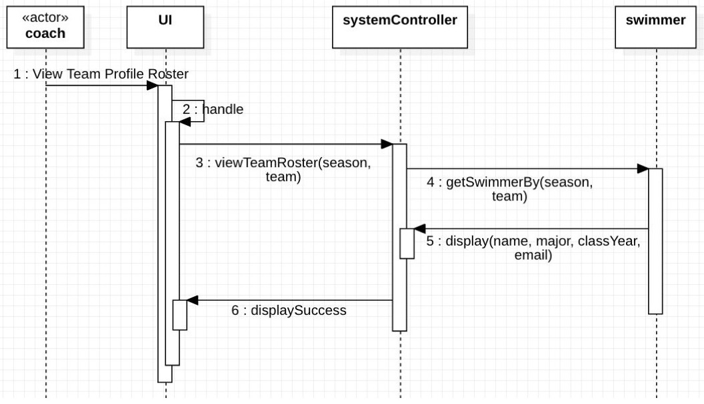

## Swim Team Management System

### Table of Contents

- [Motivation](#description)
- [Installation](#installation)
- [How to use](#how-to-use)
- [Class Diagram](#class-diagram)
- [Use Cases](#use-cases)

### Motivation

This application is designed for the use of the collegiate swim team and their coaches. 
It can keep a record of the student athletes performance in swimming and in their academics, 
which can be helpful for coaches to record data of swimmers for further analysis or review as 
an altenative to multiple spreadsheets. It can also facilates communication amongst the team 
by notifying and keeping track of relevant announcement as well as swim lesson assignment 
in one place instead of mass email.

### Installation

Check if Java has been installed:
```
$ java -version
```
Otherwise, Java can be installed following this link Install Java with https://www.java.com/en/download/help/download_options.html. 

### How to Use

Compile `.java` files into executable `.class` files.
```
$ javac -d . src/*.java
$ java app.Main
```

### Class Diagram


### Use Cases

****Sequence Diagram #1****: Add Swimmer



****Sequence Diagram #2****: Add Swim Entry



****Sequence Diagram #3****: Edit Health Record



****Sequence Diagram #4****: Make Announcement



****Sequence Diagram #5****: View Individual Profile - Swimming Progress



****Sequence Diagram #6****: View Team Profile - Roster


